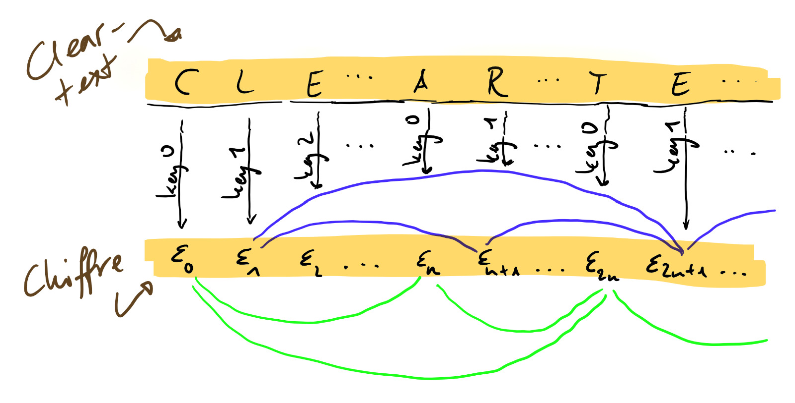

\usepackage{xcolor}
\newcommand{\ubytes}{\mathbf{U_N}}
\newcommand{\xor}{\mathbf{\,\oplus\,}}
\newcommand{\hdens}{\mathbf{\rho}}
\newcommand{\hmass}[1]{\mathbf{m}(#1)}
\newcommand{\hm}{\mathbf{m}}
\newcommand{\hdist}[2]{\hmass{#1 \xor #2}}

Let the **mass of a byte** denote its number of set bits.

$$
\hmass{u} := \text{Number of set bits in }u
$$

# Cracking repeating-key XOR

We guess a key size and over the set of every pair of two chiffre characters $(\epsilon_r, \epsilon_s)$, which were (ostensibly) encrypted by a common letter from the key, we compute the average mass $\sigma$ of their antivalence $\hm(\epsilon_r \xor \epsilon_s)$.

$$
\begin{matrix}
   \|\sigma\| \cdot \sigma = \color{green}{\hdist{\epsilon_0}{\epsilon_n}}     &\color{green}{+}  &\color{green}{\hdist{\epsilon_n}{\epsilon_{2n}}}       &\color{green}{+} &\color{green}{\hdist{\epsilon_0}{\epsilon_{2n}}}   &\color{green}{+} &\color{green}{\cdots} \\
 &\color{blue}{+} &\color{blue}{\hdist{\epsilon_1}{\epsilon_{n+1}}} &\color{blue}{+} &\color{blue}{\hdist{\epsilon_{n+1}}{\epsilon_{2n+1}}} &\color{blue}{+} &\color{blue}{\hdist{\epsilon_0}{\epsilon_{2n+1}}} &\color{blue}{+} &\color{blue}{\cdots} \\
 &+ &\vdots               &+ &\vdots                    &+ &\vdots                &+ &\ddots
\end{matrix}
$$

Guessing the correct key size will yield a significantly smaller value than that computed from incorrectly assumed key sizes. Once the key size is known the encryption can be reversed by independently decrypting the parts of the text which correspond to the same keys.

## Idea behind the solution

If **we guessed the correct key size** each summand's contribution decays into the number of bits which differ between the corresponding cleartext characters. The xor-operation is commutative, associative and self-inverse and thus the identical keys cancel themselves out.

$$
\hdist{\epsilon_r}{\epsilon_s} = \hdist{k \xor a_r}{k \xor a_s} = \hdist{a_r}{a_s}
$$

Speaking in stochastic terms, by computing $\sigma$ we're approximating the expected value of the byte-weight over $A \xor A$, which is simply the sum of the bits' expected values:

$$
\sigma^\text{(Correct)} \approx E[\hmass{A \xor A}] = E[(A \xor A)^0] + E[(A \xor A)^1] + \cdots + \underbrace{E[(A \xor A)^i]}_{\sigma_i} + \cdots
$$

Take note that the expected value of the $i^\text{th}$ summand is less than or equal to $0.5$:

$$
\sigma^\text{(Correct)}_i = E[(A \xor A)^i] = 2 \cdot p[A^i = 1] \cdot (1 - p[A^i = 1]) \leq 0.5
$$

This relation holds for arbitrary bytesets $U$, not just our source alphabet $A$. Drawing two bits from one distribution with either bit being the other's opposite is unlikely ($p \leq 50\%$) irrespective of how high or low the probability to draw a single set bit from the distribution is.

If **we did not guess the correct key size** the two keys in each of $\sigma$'s constituents $\hdist{\epsilon_j}{ \epsilon_k}$ differ and don't cancel themselves out anymore.

$$
\begin{align}
\sigma^\text{(False)}_i &= E[((A \xor K) \xor (A \xor K))^i] = E[((A \xor A) \xor (K \xor K))^i]  = p[((A \xor A) \xor (K \xor K))^i = 1] \cdot 1
\end{align}
$$

Expanding this further yields the inequality we're looking for.

$$
\sigma^\text{(False)}_i = \sigma^\text{(Correct)}_i + p[(K \xor K)^i = 1] \cdot \underbrace{\bigg(1 - 2 \sigma^\text{(Correct)}_i\bigg)}_{\geq 0} \geq \sigma^\text{(Correct)}_i
$$

As the inequality holds for every bit $i$ it also holds the the full byte.

$$
\sigma^\text{(False)} \geq \sigma^\text{(Correct)}
$$

The size of the discrepancy between the two values depends on how much the sets differ. The inequality is strict if and only if $A \neq K$.
